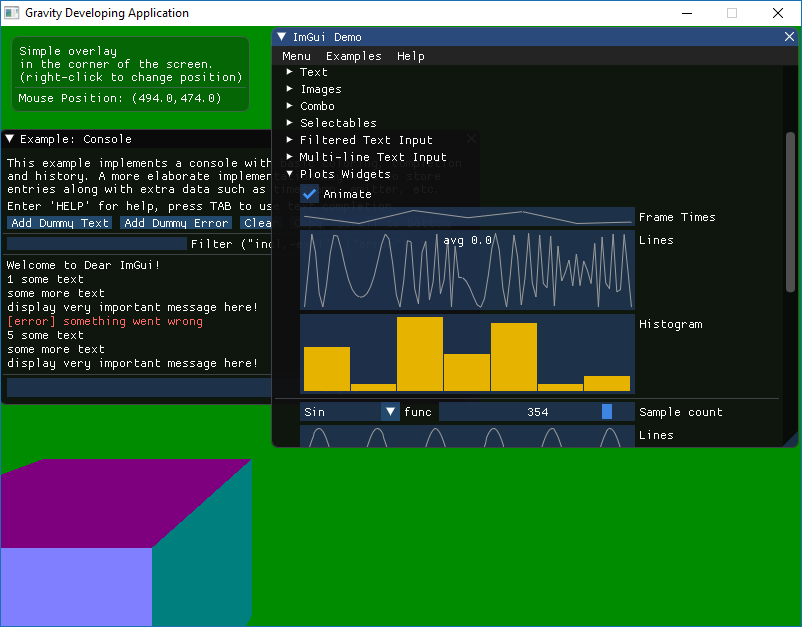

# Gravity
3D OpenGL engine for Go

Progress screenshots (latest to oldest):


---


---


---


## Gravity Development Tools
For consistent tooling purposes across platforms all common Gravity development tooling is being put into ./developing/tools as go source files. You can run these tools by using ```go run ./developing/tools <command>```

Currently available GDT commands:  
   **apitrace**   -  trace full opengl state and opens qapitrace gui (requires apitrace)  
   **depgraph**   -  graphs package dependency relationships of Gravity (requires graphiz)  
   **genversion** -  generate the version.go source file for Gravity (requires git)
   **rundevapp**  -  go run's the developing/experimenting program under ./developing

## Progress Tracking
I'm still a novice programmer, so I thought it'd be fun to do additional things to track my progress on this project as naturally I'll learn to get better over time. For instance, every major refactor/restructure I do on the code, I create a graph image of my dependency relationships. You can already see it getting better over time:

(latest to oldest)


---


---


---


---


---


---


---


---
